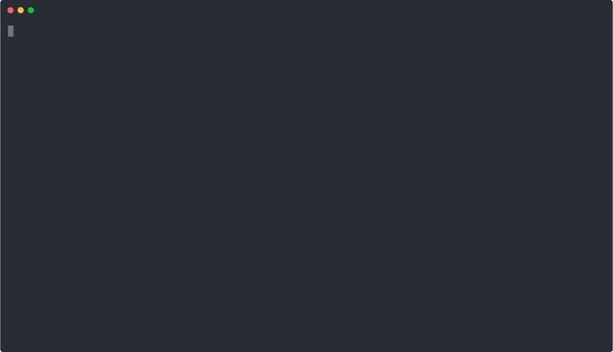

<p align="center">
  
</p>
<p align="center">
   <a href="https://milankinen.github.io/airlock">
      
   </a>
   <a href="https://github.com/milankinen/airlock/actions/workflows/ci.yml">
      
   </a>
   <a href="https://github.com/milankinen/airlock/releases/latest">
      
   </a>
</p>

---

Let AI agents (or any untrusted binary) roam freely inside a lightweight
sandbox VM that boots in seconds, has scriptable network control, and can run
any Linux-based OCI image. A single self-contained, daemonless binary — no
Docker required. Works with both macOS and Linux.<sup>1</sup>

See the [user manual](https://milankinen.github.io/airlock) or the
[design document](docs/DESIGN.md) for more details.



## Quick start

**Install** (macOS / Linux):

```bash
curl -fsSL https://github.com/milankinen/airlock/releases/latest/download/install.sh | sh
export PATH=$PATH:~/.local/bin
```

**Start VM** (in your project directory):

```bash
airlock start
```

## License

### Source code

All Rust source code in this repository (`crates` directory) is dual-licensed
under **MIT OR Apache-2.0** at your option. See [LICENSE-MIT](LICENSE-MIT) and
[LICENSE-APACHE](LICENSE-APACHE).

The Linux VM kernel and initramfs sources (in the `vm` directory) are licensed
under **GPLv2**, as derived from the Linux kernel license. See
[LICENSE-GPLv2](LICENSE-GPLv2).

### Pre-built binaries

Two variants are available on the [GitHub releases](https://github.com/milankinen/airlock/releases) page:

* **Bundled** (default, installed by `install.sh`) — includes an
  airlock-compatible Linux kernel and initramfs. The bundled kernel component
  is [GPLv2](LICENSE-GPLv2); the airlock binary itself remains
  [MIT](LICENSE-MIT) OR [Apache-2.0](LICENSE-APACHE).
* **Distroless** (`install.sh --distroless`) — does not bundle any kernel or
  initramfs. Licensed entirely under [MIT](LICENSE-MIT) OR
  [Apache-2.0](LICENSE-APACHE).

When using the distroless build, you must supply your own kernel and initramfs
with the capabilities required by the `airlockd` supervisor. See [vm setup](vm)
for more details.

## Similar projects

* [Microsandbox](https://github.com/microsandbox/microsandbox)
* [Docker Sandboxes](https://docs.docker.com/ai/sandboxes/)
* [OpenShell](https://github.com/NVIDIA/OpenShell)

---

<sup>1</sup> Even if the GitLab pipeline builds the Linux aarch64 binary, I haven't been
able to test it myself due to missing hardware.
