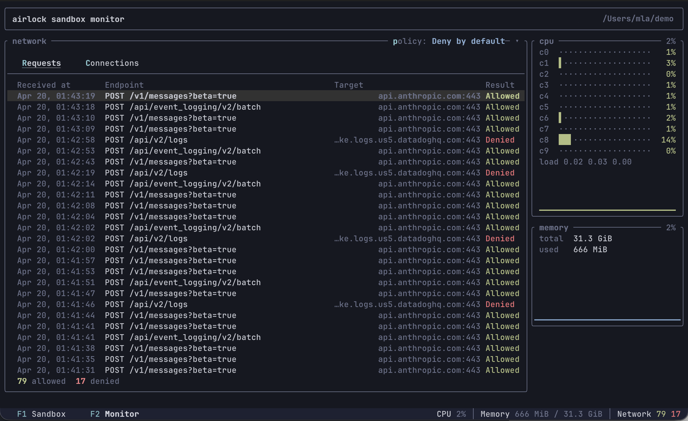

<p align="center">
  
</p>
<p align="center">
   <a href="https://milankinen.github.io/airlock">
      
   </a>
   <a href="https://github.com/milankinen/airlock/actions/workflows/ci.yml">
      
   </a>
   <a href="https://github.com/milankinen/airlock/releases/latest">
      
   </a>
</p>

---

Let AI agents (or any untrusted binary) roam freely inside a lightweight
sandbox VM that boots in seconds, has scriptable network control, and can run
any Linux-based OCI image. A single self-contained, daemonless binary — no
Docker required. Works with both macOS and Linux.

See the [user manual](https://milankinen.github.io/airlock) for more detail.


## Quick start

**Install** (macOS / Linux):

```bash
curl -fsSL https://github.com/milankinen/airlock/releases/latest/download/install.sh | sh
export PATH=$PATH:~/.local/bin
```

**Start VM** (in your project directory):

```bash
airlock start
```

**Built-in sandbox monitor**:

```bash
airlock start --monitor
```



## License

### Source code

All Rust source code in this repository is dual-licensed under **MIT OR Apache-2.0**
at your option, except [initramfs](app/vm-initramfs) and [kernel](app/vm-kernel)
that are licensed under **GPLv2** (deriving from Linux license).

### Pre-built binaries

Two variants are available on the [GitHub releases](https://github.com/milankinen/airlock/releases) page:

* **Bundled** (default, installed by `install.sh`) — includes an
  airlock-compatible Linux VM (kernel and initramfs). The bundled VM component
  is GPLv2; the airlock binary itself remains MIT OR Apache-2.0.
* **Distroless** (`install.sh --distroless`) — does not bundle any kernel or
  initramfs. Licensed entirely under MIT OR Apache-2.0.

When using the distroless build, you must supply your own kernel and initramfs
with the capabilities required by the `airlockd` supervisor.

## Similar tools

* [Microsandbox](https://github.com/microsandbox/microsandbox)
* [Docker Sandboxes](https://docs.docker.com/ai/sandboxes/)
* [OpenShell](https://github.com/NVIDIA/OpenShell)

