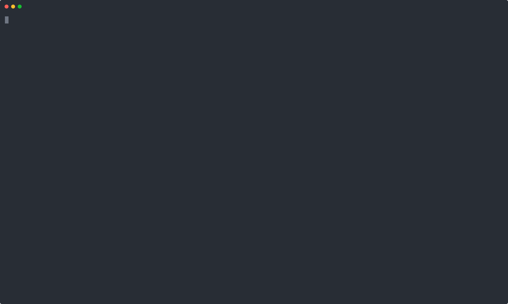
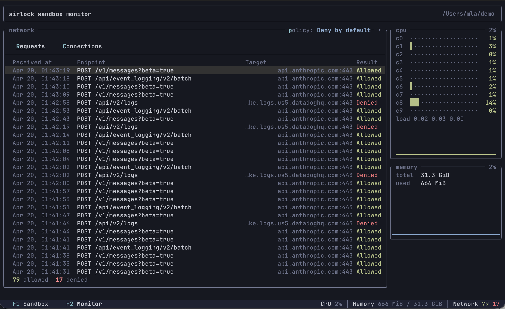

<p align="center">
  
</p>
<p align="center">
   <a href="https://milankinen.github.io/airlock"></a>
   <a href="https://github.com/milankinen/airlock/actions/workflows/ci.yml"></a>
   <a href="https://github.com/milankinen/airlock/releases/latest"></a>
</p>

---

Let AI agents (or any untrusted binary) roam freely inside a lightweight
sandbox VM that boots in seconds, has scriptable network control, and can run
any Linux-based OCI image. A single self-contained, daemonless binary — no
Docker required. Works on both macOS and Linux.



## Features

- **Configuration as code** — share sandbox setup with your team via a single TOML file.
- **Full network control** — allow or deny connections and individual HTTP
  requests, inject API keys with Lua-scriptable middleware, and inspect VM
  traffic in real time.
- **Presets** — secure defaults for Claude Code, OpenAI Codex, and GitHub
  Copilot CLI out of the box (PRs welcome for more).
- **Agent sign-ins stay on the host** — Claude Code and Codex log in from
  inside the sandbox as usual, but the real tokens never enter the VM; the
  sandbox only sees surrogates.
- **File & directory mounts** — share project files with the agent and nothing more.
- **Host port & socket forwarding** — reach the host's PostgreSQL, Redis, or Docker.
- **Agent hook integration** — surface network denials back to the agent so it
  sees *why* a tool failed and can stop to ask instead of retrying blindly.

## Quick start

OBS! This quickstart uses Claude Code as the example, but airlock itself
is agent-agnostic. See the other agent
[presets](https://milankinen.github.io/airlock/presets.html) for your
favourite agent's setup.

**The short way:** after installing, run `airlock start` in a project
that has no airlock config. It asks which distro, agents and languages
you want, writes the config with versioned
[presets](https://milankinen.github.io/airlock/presets.html), installs
them in the sandbox with an open network, and starts the sandbox. Later
runs reuse the config: `airlock start -- claude` starts the agent, and
`/login` in Claude signs it in. See
[Starting a sandbox](https://milankinen.github.io/airlock/usage/starting-sandbox.html).
The steps below do the same by hand.

### 1. Install `airlock`

The GitHub [releases](https://github.com/milankinen/airlock/releases) page
has prebuilt binaries. Download the latest one for the current user:

```bash
$ curl -fsSL https://github.com/milankinen/airlock/releases/latest/download/install.sh | sh

# The installer places the airlock binary under ~/.local/bin, so add
# that to your PATH to make it available.
$ export PATH=$PATH:~/.local/bin
```

### 2. Start your first sandbox

Navigate to your project directory, create an empty `airlock.toml`, and
start the VM. With an empty config, airlock starts an `alpine:latest`
sandbox and mounts your project directory into it. (Without any config,
`airlock start` runs the setup wizard instead.)

```bash
$ touch airlock.toml
$ airlock start
```

### 3. Set up Claude Code

Edit the project's `airlock.toml` and add the `claude` preset. It:

* Adds network
  [allow rules](https://milankinen.github.io/airlock/configuration/network.html)
  for the Anthropic hosts.
* Enables the `anthropic`
  [network service](https://milankinen.github.io/airlock/configuration/network.html#network-services):
  Claude signs in inside the sandbox, airlock keeps the real tokens on
  the host and the sandbox only sees random surrogates —
  **your tokens are never exposed to the sandbox**.
* Creates Claude placeholder settings under `~/.airlock/claude` and
  [mounts](https://milankinen.github.io/airlock/configuration/mounts.html)
  them into the sandbox so settings persist across sandboxes (you can turn
  this off if you prefer per-sandbox or per-session settings).

With `version = "1"`, the preset also installs Claude Code in the sandbox
on the first start, so the default `alpine:latest` image is sufficient.
At this point you can also set the
[network policy](https://milankinen.github.io/airlock/configuration/network.html)
to deny all outbound traffic by default unless explicitly allowed by the
network rules.

The complete `airlock.toml` looks like this:

```toml
[network]
policy = "deny-by-default"

[vm]
image = "alpine:latest"

[presets]
claude = { version = "1" }
```

Configs of earlier releases with `presets = ["claude-code"]` still work.
This list form only configures the sandbox, so the image must ship
Claude (for example `docker/sandbox-templates:claude-code`).

### 4. Sign in Claude Code

Start Claude in the sandbox and type `/login`:

```bash
$ airlock start -- claude
```

The sign-in page opens in your browser on the host, and the result is
forwarded back into the sandbox. airlock's proxy keeps the real tokens
on the host (encrypted, with the key in the
[airlock vault](https://milankinen.github.io/airlock/secrets.html)) and
refreshes them itself; Claude only ever sees surrogates. The sign-in is
shared by all your sandboxes, and `/logout` in any of them signs out
everywhere. `airlock show` lists the sign-ins. See
[Coding agents](https://milankinen.github.io/airlock/usage/coding-agents.html).

### 5. Yolo

Start the sandboxed Claude and start coding! You probably also want to
launch the airlock
[monitor dashboard](https://milankinen.github.io/airlock/usage/monitor.html)
to inspect network traffic and flip the network policy live — for example,
to briefly allow network access while tools install:

```bash
$ airlock start --monitor -- claude --dangerously-skip-permissions
```



Interested? See the [user manual](https://milankinen.github.io/airlock)
for the full details.

## License

### Source code

All Rust source code in this repository is dual-licensed under **MIT OR Apache-2.0**
at your option, except [initramfs](app/vm-initramfs) and [kernel](app/vm-kernel)
that are licensed under **GPLv2** (deriving from Linux license).

### Pre-built binaries

Two variants are available on the [GitHub releases](https://github.com/milankinen/airlock/releases) page:

* **Bundled** (default, installed by `install.sh`) — includes an
  airlock-compatible Linux VM (kernel and initramfs). The bundled VM component
  is GPLv2; the airlock binary itself remains MIT OR Apache-2.0.
* **Distroless** (`install.sh --distroless`) — does not bundle any kernel or
  initramfs. Licensed entirely under MIT OR Apache-2.0.

When using the distroless build, you must supply your own kernel and initramfs
with the capabilities required by the `airlockd` supervisor.

## Similar tools

* [Microsandbox](https://github.com/microsandbox/microsandbox)
* [Docker Sandboxes](https://docs.docker.com/ai/sandboxes/)
* [OpenShell](https://github.com/NVIDIA/OpenShell)
